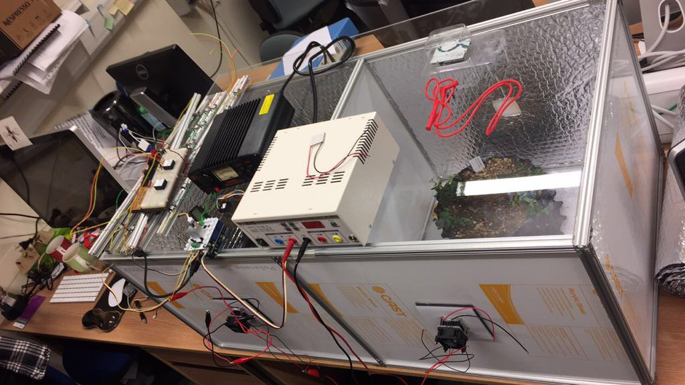

## Synopsis

To explore Boquila Trifoliata Mimicry in a laboratory setting we designed a incubator with two chambers. In one we grow Boquila alone and in the other in close contact with another plant that it is known to mimic in the wild. 

## Software

Software is kept to a minimum with just one Arduino that runs a loop that does the following steps:
1. Determine if it is night/day (12h cycle)
2. Measure Temperature in both chambers 
3. Switch blue/red/white LED array on (day) or off (night)
3. Switch heating/cooling on when measured temperature deviates by more than 1 degree from the set value (15/25 night/day )
4. Wait 10 seconds. Repeat

## Hardware

The incubator skeleton is assembled from Maker Beams and the case comprises acrylic sheets covered in Thermal foil (See image below).

## Installation, Maintenance and Testing Guide

Provide instructions on usage, describe a test scheme and show how to run the tests with code and hardware configuration examples with some representative results.

## License

MIT licence

